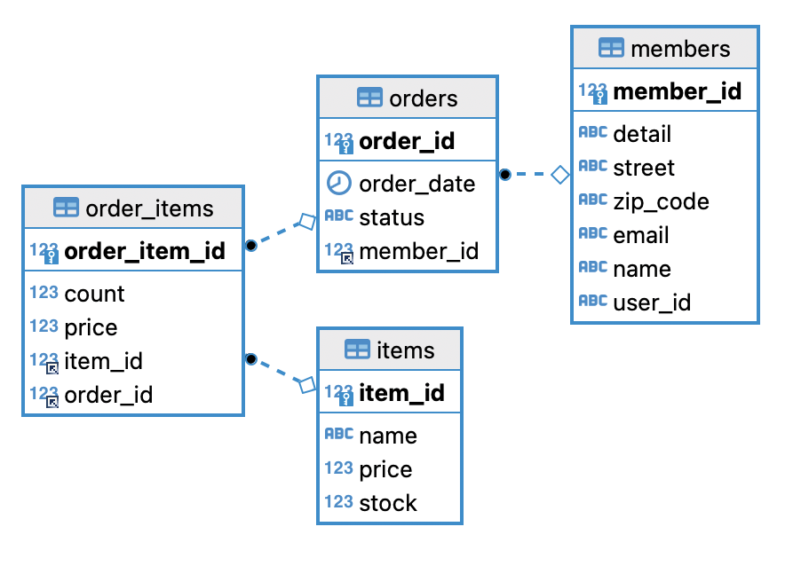

# MarketIt Order Management Server

아래와 같은 주문 관리 API를 제공합니다

- 주문 접수 처리
- 주문 완료 처리
- 주문 조회
- 주문 목록 조회

## API Documentation
http://kms-dev.tplinkdns.com:8080/swagger-ui/index.html

## 개발 환경

* Java 8
* Gradle 7.4
* Spring boot 2.6.8
* MariaDB 10.8.3

## 라이브러리

```gradle
testImplementation 'org.junit.jupiter:junit-jupiter-api:5.9.2'
testRuntimeOnly 'org.junit.jupiter:junit-jupiter-engine:5.9.2'

implementation 'org.springframework.boot:spring-boot-starter-data-jpa'
implementation 'org.springframework.boot:spring-boot-starter-web'
implementation 'org.springframework.boot:spring-boot-starter-validation'

testImplementation 'org.projectlombok:lombok:1.18.26'
testImplementation 'org.springframework.boot:spring-boot-starter-test'

runtimeOnly 'com.h2database:h2'
compileOnly 'org.projectlombok:lombok'
runtimeOnly 'org.mariadb.jdbc:mariadb-java-client'
annotationProcessor 'org.projectlombok:lombok'

implementation 'org.modelmapper:modelmapper:3.1.1'
implementation 'org.springdoc:springdoc-openapi-ui:1.6.15'
```
## Database ERD


